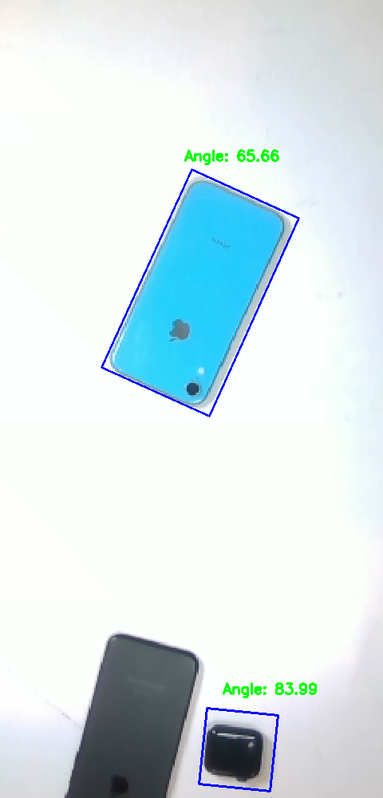
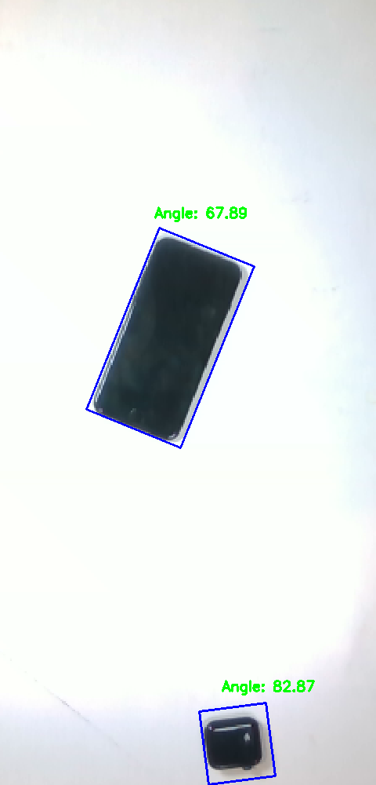
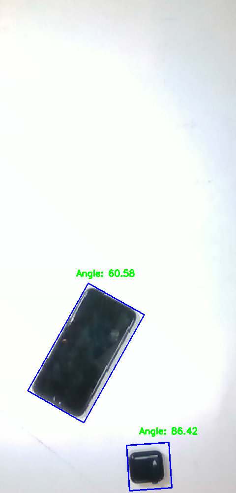
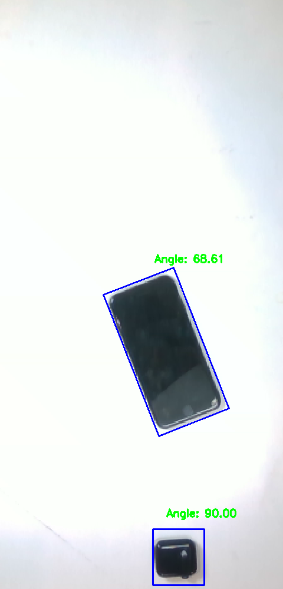
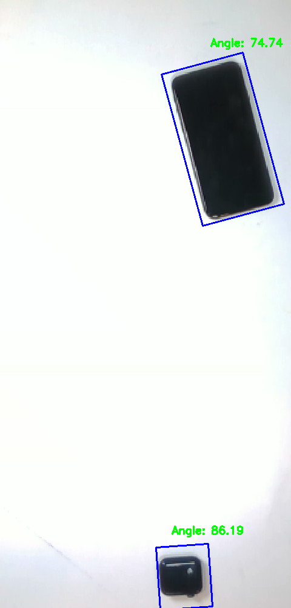
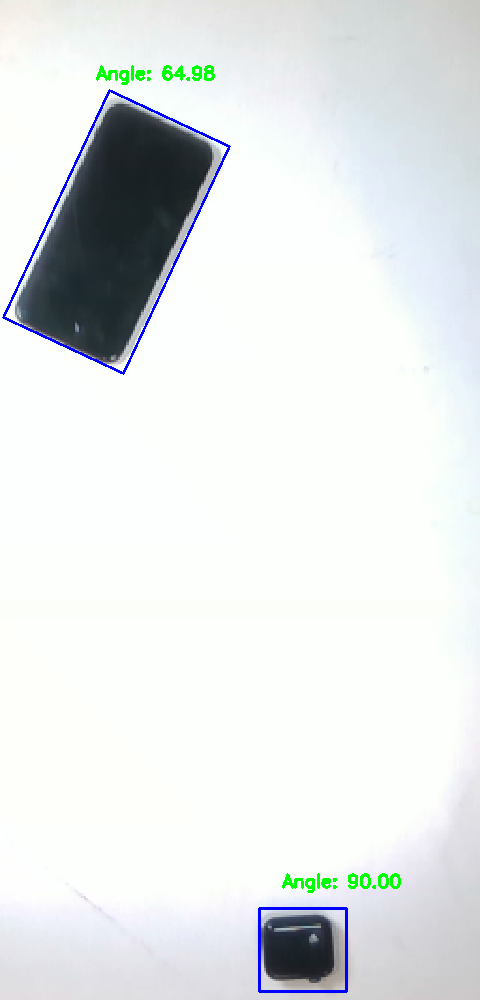

# Implementation of a tracking package using SORT : Simple online Realtime Tracker 

This is an implemenation of the phone tracker (and apple watch) for Project Wombat, Biorobotics Lab, CMU.

The sort part of the code has been used from https://github.com/abewley/sort

### Installation
To install all the requirements:
```
pip3 install -r requirements.txt
```

### Overview

The code has been built over `sort.py` with mainly 2 files, `phone_detection.py` which has the main phone detection class and uses classical CV methods for extracting the bounding box from the input gray image. The `phone_tracking.py` is the main runtime script that subscribes to the image topic and outputs the rostopics  `\tracked_image`, `\is_phone_present`  and `\phone_pose_camera`.


### Instructions 
- To run this code (with hardware)

1. Start the image and image info topic. `phone_tracking.py` expects their name to be `/camera/color/image_raw` and `/camera/color/camera_info`. The depth topic is called `/camera/depth/image_rect_raw`. If you are using a realsense camera, be sure to set the depth_align flag as true. 

2. Run `python3 src/phone_tracking.py`

- To only test the phone detections on locally stored images

1. Run `python3 src/test_phone_detection.py` 

### Some iPhone/Apple watch detection results
<p align="center">
  
  
  
  
  
  
</p>


